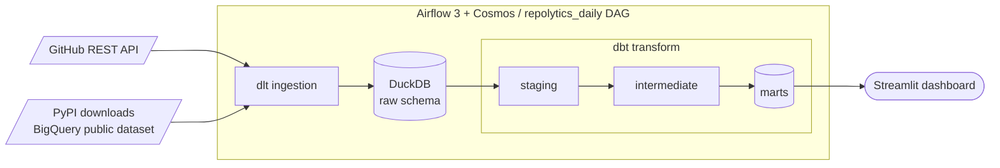
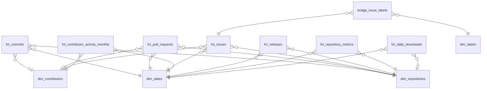

# Repolytics

[](https://github.com/Neukz/repolytics/actions/workflows/ci.yml)
[](https://codecov.io/gh/Neukz/repolytics)


An end-to-end ELT pipeline that measures the health, activity, and popularity of open-source Python projects over time.

## The question it answers

> How healthy, active, and popular are open-source Python projects, and how do their contributor communities behave over time?

Specifically, the marts and dashboard answer:

- **Popularity & health** &ndash; stars/forks trends and a composite health score
- **Velocity** &ndash; PR time-to-merge and throughput, is it improving or degrading?
- **Contributors** &ndash; bus factor (how concentrated is activity in the top N contributors?) and retention cohorts
- **Releases** &ndash; cadence and recency
- **Adoption** &ndash; PyPI downloads, and how they correlate with stars

## Architecture

Airflow orchestrates the whole pipeline: it runs the two dlt ingestion sources in parallel, then hands off to a Cosmos-rendered dbt task group. Everything from ingestion to marts lands in DuckDB as separate schemas. The dashboard queries the marts read-only.



## Tech stack

| Category       | Tools                           |
| -------------- | ------------------------------- |
| Language       | Python 3.13                     |
| Ingestion      | dlt, GitHub REST API, BigQuery  |
| Warehouse      | DuckDB                          |
| Transformation | dbt                             |
| Orchestration  | Airflow 3, Astronomer Cosmos    |
| Serving        | Streamlit, Altair               |
| Dev tooling    | uv, Ruff, Taskfile, Docker      |
| Testing & CI   | pytest, Codecov, GitHub Actions |

## Project structure

```
repolytics/
├── src/repolytics/         # dlt ingestion sources + config (installed package)
├── dbt/                    # dbt project
│   └── seeds/projects.csv  # single source of truth for which projects to analyze
├── dags/                   # Airflow DAGs
├── dashboard/              # Streamlit serving layer
├── tests/                  # unit / integration / dag tiers + fixtures
├── Taskfile.yml            # task runner - defines common commands
├── Dockerfile              # custom Airflow image
└── docker-compose.yml      # Airflow runtime (LocalExecutor + Postgres)
```

## Data model

The marts are a **fact constellation (galaxy schema)** &ndash; multiple fact tables sharing conformed dimensions. `dim_repositories`, `dim_contributors`, and `dim_dates` are the conformed spine: `dim_dates` joins every fact, `dim_repositories` all but the contributor-activity fact, and `dim_contributors` the contributor-grained facts (commits, PRs, issues, monthly activity); `dim_labels` sits apart, reached only through the `bridge_issue_labels` many-to-many bridge.



Crow's foot cardinality; a circle on the dimension side marks a nullable (optional) foreign key (e.g. commits with no GitHub-login author, or downloads for an unmapped package).

Fact grains and the dimensions each references:

| Fact                               | Grain                         | Dimensions                         |
| ---------------------------------- | ----------------------------- | ---------------------------------- |
| `fct_commits`                      | one row per commit            | repository, contributor, date      |
| `fct_pull_requests`                | one row per PR                | repository, contributor, date (x2) |
| `fct_issues`                       | one row per issue             | repository, contributor, date (x2) |
| `fct_releases`                     | one row per release           | repository, date                   |
| `fct_daily_downloads`              | one row per package/day       | repository, date                   |
| `fct_repository_metrics`           | one row per repo/snapshot day | repository, date                   |
| `fct_contributor_activity_monthly` | one row per contributor/month | contributor, date                  |

Two modeling choices worth calling out:

- **`dim_repositories` is SCD Type 2** &ndash; repository attributes are versioned via a dbt snapshot, so each fact resolves the repository version that was current *when the event occurred* (half-open date-range join). Range integrity is enforced with `dbt_utils.mutually_exclusive_ranges`.
- **Facts are incremental where it matters** &ndash; e.g. `fct_commits` and `fct_daily_downloads` use dbt's merge strategy for idempotent, cheap daily runs.

## Setup

Prerequisites: [`uv`](https://docs.astral.sh/uv/), [`task`](https://taskfile.dev), [Docker](https://www.docker.com/) (for the orchestrated run), and [`gcloud`](https://docs.cloud.google.com/sdk/docs/install-sdk) (for PyPI data source).

### 1. Clone and install

```bash
git clone https://github.com/Neukz/repolytics.git
cd repolytics
task install
task dbt:deps                    # install dbt packages
```

### 2. GitHub token

Create a [GitHub token](https://github.com/settings/tokens) with public-repo read scope and note it for the `.env` file below.

### 3. Google Cloud credentials (PyPI downloads)

PyPI download stats come from the `bigquery-public-data.pypi.file_downloads` public dataset. Queries are billed to *your* project (free under 1 TB/month) and authenticate via Application Default Credentials:

```bash
gcloud config set project <project_id>          # or: gcloud projects create <project_id>
gcloud services enable bigquery.googleapis.com
gcloud auth application-default login           # writes ADC to ~/.config/gcloud/
```

Docker mounts your ADC file into the containers automatically (see `docker-compose.yml`).

### 4. Configure `.env`

```bash
cp .env.example .env
```

Get the UID and generate the Airflow Fernet key:

```bash
echo "AIRFLOW_UID=$(id -u)"
uv run python -c "from cryptography.fernet import Fernet; print(f'FERNET_KEY={Fernet.generate_key().decode()}')"
```

Then fill in:

```env
GITHUB_TOKEN=<token from step 2.>
GCP_PROJECT=<project_id from step 3.>
AIRFLOW_UID=<generated above>
FERNET_KEY=<generated above>
```

### 5a. Run the full pipeline in Docker (recommended)

```bash
task dbt:manifest                # Cosmos renders the DAG from this manifest - build it first
docker compose up                # Airflow (LocalExecutor + Postgres)
```

Open the Airflow UI at <http://localhost:8080>, log in with the account `airflow` and password `airflow`, then enable and trigger the `repolytics_daily` DAG.

### 5b. Or run it step by step in your terminal

```bash
task dlt:ingest                  # GitHub + PyPI -> DuckDB raw schema
task dbt:build                   # staging -> intermediate -> marts (+ all dbt tests)
```

### 6. View the analytics dashboard

```bash
task dashboard                   # Streamlit dashboard at http://localhost:8501
```

The set of projects to analyze lives in **`dbt/seeds/projects.csv`** (`repo,package` rows) &ndash; the source of truth for both dlt and dbt. Modify to track your preferred set of projects.

## Testing & CI

Three pytest tiers, split by path:

- **`tests/unit/`** &ndash; pure logic, no I/O: config, provenance stamping, pipeline skip paths, and the PyPI source's query building and row mapping (via an injectable fake runner).
- **`tests/integration/`** &ndash; runs the real dlt sources into a temporary DuckDB from recorded fixtures (GitHub over mocked HTTP, PyPI via a fake BigQuery runner), asserting the `raw` schema contract dbt depends on, plus GitHub's incremental cursor.
- **`tests/dag/`** &ndash; Airflow DAG-parse policy checks.

CI runs these as parallel jobs and executes dbt: the `dbt-build` job seeds the `raw` schema from the recorded fixtures and runs `dbt build` against a file-backed DuckDB, exercising every model plus all schema/data tests on fixture data. There is no live warehouse in CI.

```bash
task ci      # mirrors the GitHub Actions gate locally
```

## Trade-offs & limitations

- **DuckDB is single-writer.** The DAG sets `max_active_tasks=1` and `max_active_runs=1` to serialize everything, because a DuckDB file allows only one writer at a time. That rules out concurrent ingestion/transform and horizontal scaling; the intended escape hatch is swapping DuckDB for a cloud warehouse (the dbt SQL is largely portable).
- **GitHub has no true historical backfill.** The dlt incremental cursor is global (not per-interval), so ingestion fetches current-state-forward and skips historical backfill runs. Full history accumulates through `write_disposition="merge"` over successive daily runs &ndash; it can't replay an arbitrary past window on demand the way PyPI can.
- **PyPI backfill bills BigQuery.** Each day is a query against the public dataset. It's free under 1 TB/month, but a wide multi-year backfill will consume quota, so it's partition-pruned to one day per run.
- **Popularity/health facts start as a single snapshot.** `fct_repository_metrics` captures one row per repo per run, so stars/forks trends and the health-score trajectory only become meaningful after several daily runs accrue. The dashboard degrades gracefully (current value + note) until then.
- **The health score is computed in the app, not persisted.** It lives in `dashboard/lib/health.py`, which means it isn't materialized or covered by dbt tests (see [Future work](#future-work)).
- **Test coverage is limited.** Coverage is scoped to `src/repolytics/` (config + dlt sources, per `[tool.coverage.run]`); the Streamlit dashboard and the Airflow DAG at runtime are untested.

## Future work

- **Scale the seed to 10-15 projects.** `dbt/seeds/projects.csv` currently tracks 2 repos; more projects unlock the comparative analytics the marts are built for &ndash; cross-project bus factor, retention curves, and downloads-vs-stars correlation.
- **Graduate the health score to `fct_repository_health`.** Move the composite metric out of `dashboard/lib/health.py` into a materialized, contract-and-test-covered mart so it's reusable beyond the dashboard and versioned with the rest of the model.
- **Migrate to a cloud warehouse** to lift the single-writer constraint, enable concurrent serving, and separate storage from compute. The staging/marts SQL is mostly portable; the dlt destination and dbt profile are the main changes.
- **Add a weekly aggregation DAG** writing rollups (retention cohorts, rolling health) into a `metrics` schema &ndash; cheaper for the dashboard than recomputing over the atomic facts on every query.
- **Tighten staging-layer boundaries.** A few staging models reassemble dlt parent/child tables via joins that strictly belong in the intermediate layer, and `dim_contributors` re-aggregates staging in parallel with `int_contributor_activity`; deriving both from one event stream would give contributor activity a single source of truth.
